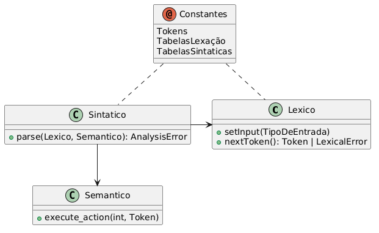

# Ações Semânticas e de Geração de Código

## Definição dos Aspectos Semânticos

Aspectos Semânticos são definidos atraves da introdução de Ações Semânticas 
dentro das produções da especificação sintática. Estas ações são da forma `#<número>`.

Durante a analise sintática, ação semânticas instruem o analisador sintático a envocar 
o analisador semântico, passando-lhe como parâmetros o número da ação, e o mais recente 
token produzido pelo analisador léxico. Cabe ao usuário implementar as ações semânticas, 
na linguagem de destino.

Estas ações podem ser responsáveis por tarefas de análise semântica (adicionar algum 
símbolo à tabela de símbolos, checar tipos, verificar se um símbolo ja foi declarado, 
etc) ou pela geração de código (fazendo-se com que a ação semântica chame o gerador de 
código).

---

Foram colocadas na gramática do exemplo a seguir algumas ações. Cabe ao usuário dar sentido a elas, implementando-as.

A ação 2 poderia ser resposável por checar o tipo da expressão e gerar o código para imprimir seu valor.

```
<C> ::= <IF>
      | <WHILE>
      | <WRITE>
      | begin <C_LIST> end;

<C_LIST> ::= <C> ";" <C_LIST> | î;

<IF>    ::= if <E> #1 then <C> <ELSE>;
<ELOSE> ::= else <C> | î;

<WHILE> ::= while <E> #1 do <C>;
<WRITE> ::= write "(" <E> #2 ")";

<E> ::= id #3
      | num #4;
```

## Geração de Código e Uso Geral

O código gerado pelo Web GALS é padronizado entre todas as linguagens suportadas e seguem
o seguinte formato:

<center></center>
<center><i>Diagrama de classes do código gerado.</i></center>

Em geral, o código gira em torno da classe `Sintatico`, que provêm o *mainloop* do programa com a função `parse()`. Esta função
consume tokens da classe `Lexico` chamando a função `nextToken()` efetuado ambas analise léxica e sintática.
Quando apropriado, esta função chama `execute_action()` da classe `Semantico`.

A implementação da classe `Semantico` não é provida pelo Web GALS, mas somente seu esqueleto; a implementação vem do usuário.

---

Segue a implementação de uma função main apropriada para cada linguagem:

##### Java
```java
import java.io.FileReader;

public class Main
{
	public static void main(String[] args)
	{

		var lex = new Lexico();
		var syn = new Sintatico();
		var sem = new Semantico();

		try (var f = new FileReader("program.txt")) {
			lex.setInput(f);
			syn.parse(lex, sem);
		} catch (Exception e) {
			System.out.println(e);
		}

	}
}
```

##### C++
```c++
#include <iostream>
#include <fstream>
#include <Lexico.h>
#include <Sintatico.h>
#include <Semantico.h>

int main(void) {

	Lexico lex;
	Sintatico syn;
	Semantico sem;

	auto stream = std::ifstream("program.txt");

	if (!stream.is_open())
	{
		std::cerr << "Não foi possível abrir o arquivo." << std::endl;
		return 1;
	}

	lex.setInput(stream);

	try
	{
		syn.parse(&lex, &sem);
	}
	catch ( AnalysisError& e )
	{
		std::cerr << e.getMessage() << " @ " << e.getPosition() << std::endl;
	}

}
```

##### Delphi

```pascal
lexico : TLexico;
sintatico : TSintatico;
semantico : TSemantico;
//...
lexico := TLexico.create;
sintatico := TSintatico.create;
semantico := TSemantico.create;
//...
lexico.setInput( (* entrada *) );
//...
try
    sintatico.parse(lexico, semantico);
except
  on e : ELexicalError do
    //Trada erros léxicos
  on e : ESyntacticError do
    //Trada erros sintáticos
  on e : ESemanticError do
    //Trada erros semânticos
end;
//...
lexico.destroy;
sintatico.destroy;
semantico.destroy;
```

##### Python

```python
from Lexico    import Lexico
from Sintatico import Sintatico
from Semantico import Semantico
from Errors    import AnalysisError

with open('program.txt') as file:

    lex = Lexico()
    syn = Sintatico()
    sem = Semantico()

    lex.set_input(file)

    try:
        syn.parse(lex, sem)
    except AnalysisError as e:
        print(e)

```

##### Rust

```rust
use std::{fs::File, io::BufReader};

use crate::{
    scanner::Lexico,
    parser::Sintatico,
    codegen::Semantico
};

mod token;
mod errors;
mod constants;
mod scanner;
mod parser;
mod codegen;

fn main() {
    let file = File::open("program.txt").expect("erro ao abrir arquivo");
    let lex = Lexico::new(BufReader::new(file));
    let sem = Semantico::new();
    let syn = Sintatico::new(lex, sem);

    if let Err(e) = syn.parse() {
        eprintln!("{e}");
    }
}
```

## Detalhes do código

Dado a semelhança entre as implementações, será somente exemplificado trechos de código em Java.
Quaisqueres diferenças podem ser inferidas lendo o código fonte.

### Detalhes do analisador Léxico

Um analisador léxico possui os seguintes métodos:

- Construtor `Lexico()`: construtor padrão.
- Construtor `Lexico(TipoEntrada input)`: construtor de inicialização.
- `void setInput(TipoEntrada input)`: Método para passar a entrada ao analisador
- `void setPosition(int pos)`: Método para indicar a posição a partir da qual o próximo token deve ser procurado
- `Token nextToken() throws LexicalError`: Método chamado para se obter o próximo token da entrada

`TipoEntrada` refere-se ao tipo específicado na documentação de opções "Modal - Forma de Entrada".

O método `nextToken()` é o pricipal desta classe. 
A cada chamada o analisador tenta identificar um token a partir da posição atual na entrada. Existem três resultados possíveis:

- **Um token é encontrado**: Neste caso, é retornado um novo objeto da classe Token.
- **A posição de leitura era o fim da entrada**: Neste caso é retornado nulo ao chamador, indicando o fim do fluxo de tokens.
- **Nenhum token reconhecido**: Se nenhum token foi reconhecido pelo analisador, será lançada uma exceção.

A cada chamada com sucesso, um novo token é alocado. Em C++ e Delphi ele deve ser desalocado quando não for mais necessário.

O `Token` retornado possui três atributos: seu valor numérico (`int getId()`, seu valor textual (`String getLexeme()`) e a posição na entrada onde foi encontrado (`int getPosition()`). 

É possível usar a classe `Lexico` diretamente da seguinte forma:

```java
Lexico lexico = new Lexico();
//...
lexico.setInput( /* entrada */ );
//...
try
{
    Token t = null;
    while ( (t = lexico.nextToken()) != null )
    {
        System.out.println(t.getLexeme());
    }
}
catch ( LexicalError e )
{
    System.err.println(e.getMessage() + "e em " + e.getPosition());
}
```

| Java                                  | C++                                     | Delphi                                          | Python                                                   | Rust                                                                            |
|---------------------------------------|-----------------------------------------|-------------------------------------------------|----------------------------------------------------------|---------------------------------------------------------------------------------|
| <pre>Lexico()</pre>                   | <pre>Lexico(void)</pre>                 | <pre>constructor create</pre>                   | <pre>def __init__(self, input: TipoEntrada = None)</pre> | <pre>fn new(lex: Lexico, sem: Semantico\<TipoEntrada\>) -> Self</pre>           |
| <pre>Lexico(TipoEntrada)</pre>        | <pre>Lexico(TipoEntrada)</pre>          | <pre>constructor create(input : TStream)</pre>  | <pre>def __init__(self, input: TipoEntrada = None)</pre> | <pre>N/A</pre>                                                                  |
| <pre>void setInput(TipoEntrada)</pre> | <pre>void setInput(TipoEntrada)</pre>   | <pre>procedure setInput(input : TStream)</pre>  | <pre>def set_input(self, input: TipoEntrada)</pre>       | <pre>N/A</pre>                                                                  |
| <pre>void setPosition(int)</pre>      | <pre>void setPosition(int)</pre>        | <pre>procedure setPosition(pos : integer)</pre> | <pre>def set_position(self, pos)</pre>                   | <pre>N/A</pre>                                                                  |
| <pre>Token nextToken()</pre>          | <pre>Token* nextToken(void)</pre>       | <pre>function nextToken : TToken</pre>          | <pre>def next_token(self)</pre>                          | <pre>fn next_token(&mut self) -> Option\<Result\<Token, AnalysisError\>\></pre> |
| <pre>String getLexeme()</pre>         | <pre>std::string& getLexeme(void)</pre> | <pre>function getLexeme : string</pre>          | <pre>lexeme: str</pre>                                   | <pre>fn get_lexeme(&self) -> &String</pre>                                      |
| <pre>int getPosition()</pre>          | <pre>int getPosition(void)</pre>        | <pre>function getPosition : integer</pre>       | <pre>position: int</pre>                                 | <pre>fn get_position(&self) -> usize</pre>                                      |
| <pre>int getId()</pre>                | <pre>TokenId getId(void)</pre>          | <pre>function getId : integer</pre>             | <pre>tkid: TokenId</pre>                                 | <pre>fn get_id(&self) -> TokenId</pre>                                          |

> [!NOTE]
> A função Python `def set_position(self, pos)` não existe caso o tipo de entrada seja Stream,
> e a implementação para Rust não expõe tal função.

### Detalhes do analisador Sintatico

O analisador sintático possui apenas um método público (além de seu construtor padrão):

```java
void parse(Lexico scanner, Semantico semanticAnalyser) throws LexicalError, SyntacticError, SemanticError
```

Para este método é passado um analisador léxico e um semântico.
Se nenhum erro for detectado, o método termina de forma normal (o analisador semântico deve ser programado de forma que ele guarde os resultados finais da análise, se houverem).

Este método é o "coração" do processo de análise, e os erros detectados durante esta devem ser tratados pelo chamador deste método.
Erros léxicos vem do analisador léxico na forma da exceção LexicalError. Erros semânticos serão reportados via a exceção SemanticError. O próprio analisador sintático detecta erros, e lança a exceção SyntacticError quando os encontra.

| Java                                                              | C++                                                                 | Delphi                                                                       | Python                                        | Rust |
|-------------------------------------------------------------------|---------------------------------------------------------------------|------------------------------------------------------------------------------|-----------------------------------------------|------|
| <pre>void parse(Lexico scanner, Semantico semanticAnalyser)</pre> | <pre>void parse(Lexico* scanner, Semantico* semanticAnalyser)</pre> | <pre>procedure parse(scanner : TLexico; semanticAnalyser : TSemantico)</pre> | <pre>def parse(self, scanner, semantic)</pre> | ???  |


#### Interface com o Analisador Léxico

Sempre que um novo Token for preciso, o método `nextToken()` do analisador léxico é invocado. É esperado que este método retorne nulo quando não houverem mais Tokens para serem processados, e que lance uma exceção `LexicalError` quando encontre um erro léxico.
Em C++ e em Delphi, é esperado que a cada chamada o token retornado seja alocado dinâmicamente, pois o mesmo será desalocado posteriormente (via delete/Destroy);

#### Interface com o Analisador Semântico

Sempre que uma ação semântica for necessária, o analisador semântico será chamado, pelo método `executeAction()`, que recebe de parâmetro o número da ação atual, e o mais recente token produzido pelo léxico.
É esperado que o analisador semântico lance um `SemanticError` quando encontrar uma situação de erro semântico.

### Detalhes do analisador Semantico


O Analisador Semântico é sempre implementado pelo usuário. Sua interface consiste do método:

```java
void executeAction(int action, Token token) throws SemanticError
```

Os parâmetros indicam a ação semântica que deve ser executada e o mais recente Token produzido pelo analisador léxico (em c++ ele é passado via ponteiro).

Pode-se implementar de varios modos este método. Para gramáticas com poucas açãoes semânticas, pode-se construir um switch/case em função do parametro action e colocar o código da ação diretamente dentro deste comando, ou delegar um outro método para executá-la (com certeza mais recomendado).
Em gramáticas com muitas ações, pode ser mais interessante criar um array de callbacks, indexado pelo número da ação semântica.

Se um erro semântico for detectado, ele deve ser informado ao analisador sintático lançando uma excessão do tipo SemanticError. Isto é importante para manter a uniformidade na detecção de erros.

### Detalhes das tabelas de Erro

As exceções geradas pelos analisadores léxico e sintático utilizam como mensagens de erro constates literais declaradas nos arquivos `ScannerConstants.java` e `ParserConstants.java`, `Constants.cpp`, `UConstants.pas`, `Constants.py` ou ainda `Constants.rs` dependendo da linguagem objeto.

São geradas mensagens padrão, mas na maioria dos casos mensagens personalisadas irão identificar melhor os erros para o usuário final da aplicação. 

### Detalhes das Exceções

As exceções utilizados no GALS possuem dois atributos: uma mensagem de erro e a posição (na entrada) onde o erro aconteceu. 
Existem três classes concretas de exceções: `LexicalError`, `SyntacticError` e `SemanticError`, 
que são produzidas pelos analisadores léxico, sintático e semântico respectivamente. 
Existe ainda uma quarta classe `AnalysisError`, que serve de base para as outras três.

| Java                         | C++                                     | Delphi                                    | Python                   | Rust                                       |
|------------------------------|-----------------------------------------|-------------------------------------------|--------------------------|--------------------------------------------|
| <pre>int getPosition()</pre> | <pre>int getPosition(void)</pre>        | <pre>function getPosition : integer</pre> | <pre>position: int</pre> | <pre>fn get_position(&self) -> usize</pre> |
| <pre>String toString()</pre> | <pre>const char* getMessage(void)</pre> | <pre>function getMessage : string</pre>   | <pre>message: str</pre>  | <pre>fn get_message(&self) -> String</pre> |

O tratamento de erros em Rust é um pouco diferente. Ao invéz de se lançar uma exceção, a função deve retornar o tipo `Result<T, E>`, onde `T` é o retorno normal
da função e `E` é o tipo do erro. 

Enquanto nas outras quatro implementações, `LexicalError`, `SyntacticError` e `SemanticError` são subclasses de `AnalysisError`,
na implementação em Rust existem somente `AnalysisError` como uma classe concreta, sendo a distinção entre as três variantes feita via uma enumeração.

Em sumo, todas as funções que propagam erro retornam `Result<T, AnalysisError>`.

Como conveniência, as funções `AnalysisError::lexical()`, `AnalysisError::sintatic()` e `AnalysisError::semantic()` existem para criar
um erro do tipo correspondente.


```rust
fn inner() -> Result<(), AnalysisError> {
	return Err(AnalysisError::semantic("mensagem".into(), 1));
}


fn outer() -> Result<i32, AnalysisError> {
	inner()?; // o operador ? causa o retorno antecipado caso haja erro, similar a uma exceção.
	return Ok(1234);
}

fn main() {
	let res = match outer() {
		Ok(r) => r,
		Err(e) => {
			match e.get_kind() {
				AnalysisErrorKind::Lexical => {...},
				AnalysisErrorKind::Syntatic => {...},
				AnalysisErrorKind::Semantic => {...},
			},
		}
	};

	// ou simplesmente
	// let res = outer()?;
}
```