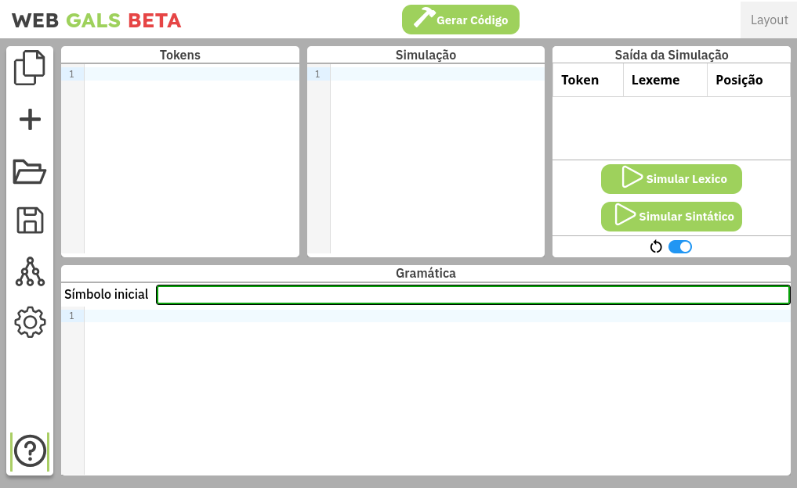
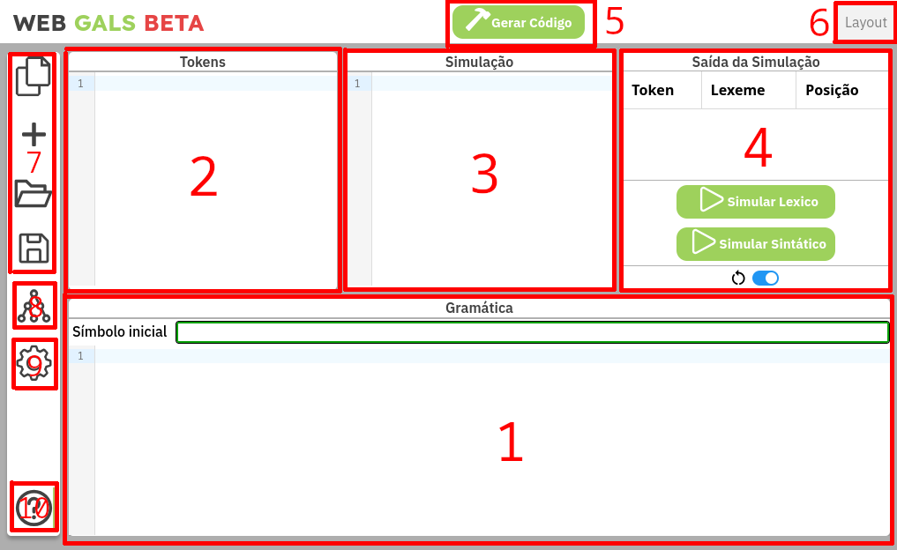
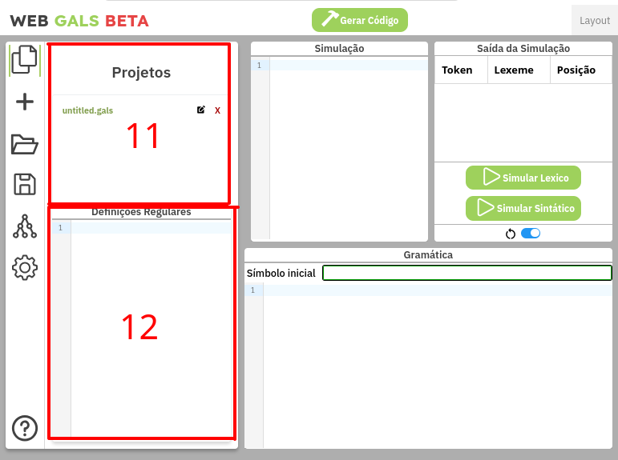
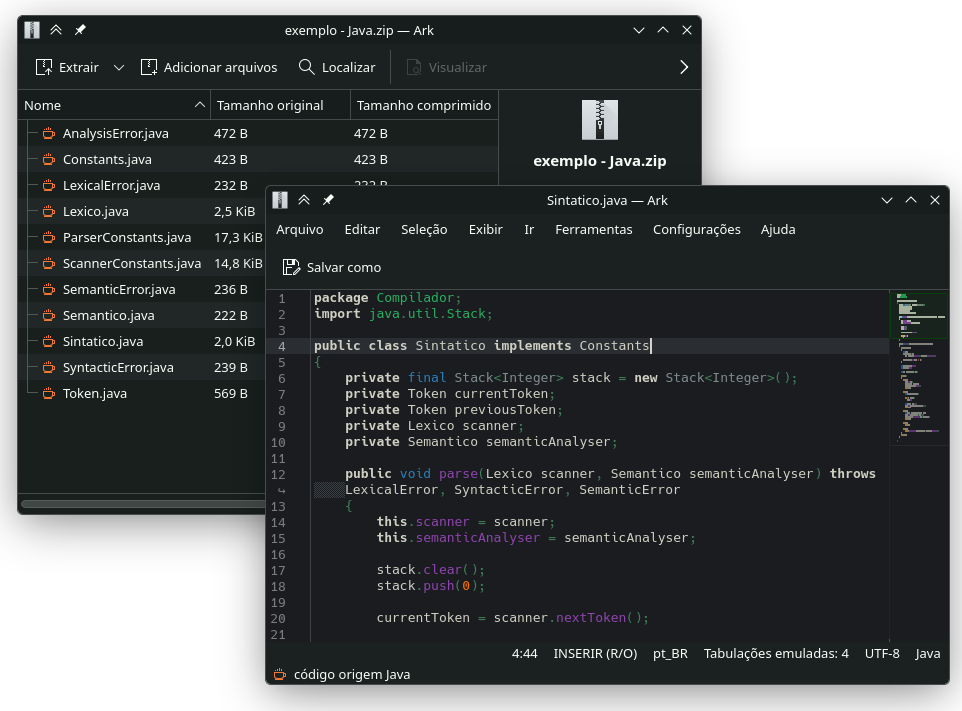
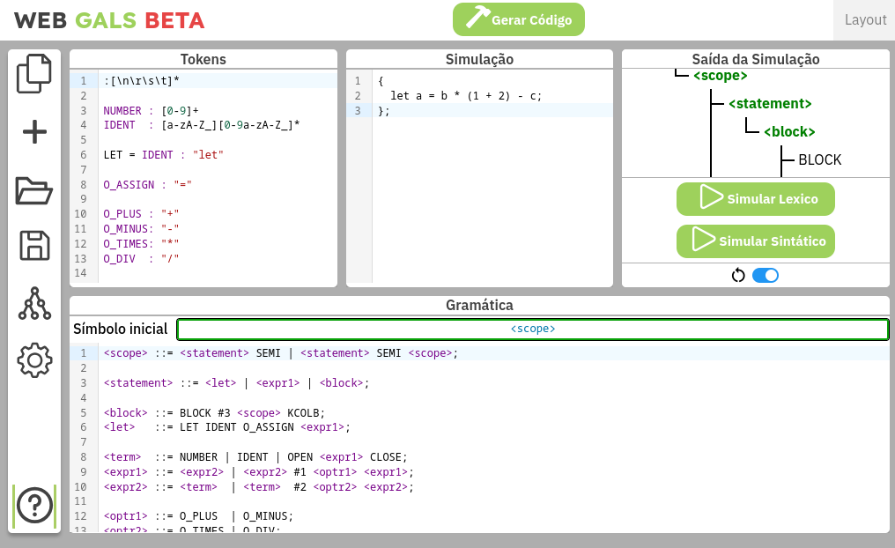

# Introdução

O **(Web) GALS** é um ambiente para a geração de analisadores léxicos e sintáticos, originalmente desenvolvido por Carlos Eduardo Gesser como trabalho de conclusão de curso do Curso de Bacharelado em Ciências da Computação, da Universidade Federal de Santa Catarina, sendo desenvolvido sob a orientação do Prof. Olinto José Varela Furtado. Posteriormente, este projeto foi ampliado na forma do Web GALS, também no formato de trabalho de conclusão de curso de Ciências da Computação, pelos alunos Daniel Akira Nakamura Gullich e Vinícius Schütz Piva, ambos orientados pelo Prof. Eduardo Alves da Silva, na Universidade do Vale do Itajaí.

Esta ferramenta pode ser usada em [https://lia-univali.github.io/Web-GALS/](https://lia-univali.github.io/Web-GALS/) (v2024) e [https://vsczpv.github.io/Web-GALS/](https://vsczpv.github.io/Web-GALS/) (v2026).

O Web GALS é uma ferramenta de Software Livre. Seu código fonte é liberado sob a Licença Publica GNU. ([http://www.gnu.org/](http://www.gnu.org/))

> [!NOTE]
> A versão antiga da documentação está disponível em [https://lia-univali.github.io/Web-GALS/files/help.html](https://lia-univali.github.io/Web-GALS/files/help.html)

## Uso Geral

O Web GALS apresenta uma área de trabalho com quatro janelas, um gerenciador de projetos e um menu de configurações.


<center><i>Screenshot da interface principal do Web GALS.</i></center>

De modo geral, usa-se as janelas para definir-se as regras de lexação e análise sintática da linguagem a ser projetada, com
definições mais específicas como algorítmos de escolha ou linguagem de implementação sendo escolhidas via o menu de configurações.



<center><i>Interface do Web GALS, anotada.</i></center>

Especificamente, a interface principal do Web GALS consiste de:

1. **Área da Gramática:** Nesta área de texto é escrito as regras gramáticais da linguagem sendo projetada. Acima do editor há um campo para especificar o símbolo inicial da linguagem.
2. **Área dos Tokens:** Nesta área de texto é escrito os Tokens reconhecidos pelo scanner e suas regras de lexação.
3. **Área da Simulação:** Nesta área de texto é escrito um programa de exemplo, que será analisado pelo simulador segundo as regras descritas nas duas áreas anteriores.
4. **Saída da Simulação:** Nesta área é mostrado a saída de tanto o scanner léxico (lista de Tokens) quanto do analísador sintático (árvore de derivação), dependendo da escolha do usuário.
5. **Botão de gerar código:** Este botão, após clicá-lo, o Web GALS irá gerar um código fonte de compilador da linguagem projetada.
6. **Diálogo de Layout:** Este dialogo permite o usuário mudar o layout da área de trabalho do Web GALS.
7. **Gerenciador de Projetos:** Este quatro botões, junto ao seu *tray*, permitem o usuário gerenciar múltiplos projetos ao mesmo tempo.
8. **Visualizador de Constantes:** Este botão abre um *tray* que oferece várias opções de visualização quanto as constantes internas dos analisadores gerados.
9. **Menu de Configurações:** Este é o botão do menu de configurações do projeto.
10. **Informações do Web GALS:** Este botão abre um *tray* que mostra informações sobre Web GALS.
11. **Aba de Projetos**: A aba onde é possível ver os seu projetos em andamento.
12. **Área de Definições Regulares**: Nesta área de texto é escrito as definições regulares.

Após finalizar um projeto no Web GALS, é possível gerar um código *template* que implementa um compilador que processa a linguagem projetada; tal serve de ponto de partida para a analise semântica, implementada pelo usuário em código.


<center><i>Exemplo de projeto gerado pelo Web GALS.</i></center>

Tendo de exemplo [o seguinte arquivo de projeto](https://vsczpv.github.io/Web-GALS/files/exemplo.gals), com a seguinte entrada de simulação, o estado do Web GALS se encontra como no da figura:
```rust
{
	let a = b * (1 + 2) - c;
};
```
<center><i>Entrada de simulação.</i></center>

<br><br>


<center><i>Estado do Web GALS após simulação sintática.</i></center>
