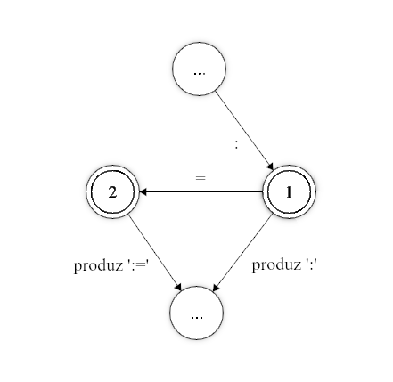

# Definição de Aspectos Léxicos

Os aspectos léxicos de um projeto no Web GALS são definidos pela declaração
dos Tokens e suas expressões regulares.

O analisador léxico gerado utilizará as expressões regulares dos Tokens para
a criação de um Autômato Finito com múltiplos estados finais, cada um deles correspondendo a um dos Tokens declarados.


## Expressões Regulares

O coração de todo analisador léxico está nas expressões regulares. Uma expressão regular é uma regra que define uma sequência de passos a casar com uma entrada, retornando se sim ou não a entrada está de acordo com a regra.

Esta tabela ilustra as possibilidades de expressões regulares suportadas pela ferramenta. Quaisquer combinações entre estes padrões é possível. Espaços em branco são ignorados (exceto entre aspas).

| Expressão | Reconhece
|-----------|------------------------------------------------------|
| `a`       | reconhece a                                          |
| `ab`      | reconhece a seguido de b                             |
| `a\|b`    | reconhece a ou b                                     |
| `[abc]`   | reconhece a, b ou c                                  |
| `[^abc]`  | reconhece qualquer caractere, exceto a, b e c        |
| `[a-z]`   | reconhece a, b, c, ... ou z                          |
| `a*`      | reconhece zero ou mais a's                           |
| `a+`      | reconhece um ou mais a's                             |
| `a?`      | reconhece um a ou nenhum a.                          |
| `(a\|b)*` | reconhece qualquer número de a's ou b's              |
| `.`       | reconhece qualquer caractere, exceto quebra de linha |
| `\123`    | reconhece o caractere ASCII 123 (decimal)            |

Os operadores posfixos `*`, `+` e `?` tem a maior prioridade. Em seguida está a concatenação e por fim a união `|`. Parênteses podem ser utilizador para agrupar símbolos.

Os caracteres `"` `\` `|` `*` `+` `?` `(` `)` `[` `]` `{` `}` `.` `^` `-` possuem significado especial. Para utilizá-los como caracteres normais deve-se precedê-los por \, ou colocá-los entre aspas. Qualquer seqüência de caracteres entre aspas é tratada como caracteres ordinários.

| Expressão | Reconhece |
|----------|-----------------------------------------|
| `\+`     | reconhece +                             |
| `"+*"`   | reconhece + seguido de *                |
| `"a""b"` | reconhece a, seguido de ", seguido de b |
| `\"`     | reconhece "                             |

Existem ainda os caracteres não imprimíveis, representados por seqüências de escape 

| Expressão | Reconhece |
|--------|-------------------------------------------------|
| `\n`   | Line Feed                                       |
| `\r`   | Carriage Return                                 |
| `\s`   | Espaço                                          |
| `\t`   | Tabulação                                       |
| `\b`   | Backspace                                       |
| `\e`   | Esc                                             |
| `\XXX` | O caractere ASCII XXX (XXX é um número decimal) |

Todas as regras listadas acima podem ser concatenadas em uma unica e longa regra. Por exemplo, `[a-zA-Z_][0-9a-z&]+` irá reconhecer qualquer palavra que começe com uma letra (tanto maiúscula como minúscula) ou *underline*,
seguido de qualquer número, letra minúscula ou o caractére '&', zero ou mais vezes, como `Z0a02be&` ou `_aazz`, mas não `00ABC`.

## Tokens

Antes de se mostrar como são declarados os Tokens é preciso se dar uma pequena explicação sobre o funcionamento do analisador léxico.

O analisador gerado funciona simulando um autômato finito, rodando em cima de uma tabela de transições. O analisador verifica o próximo caractere da entrada e o estado atual do autômato (inicialmente zero) e move o autômato para seu próximo estado.
Se eventualmente o autômato chegar a um estado final, sempre correspondente a um token, ele ainda não pode dar a análise deste token como concluída, pois é preciso tentar identificar a sequência de caracteres mais longa possível (um analisador para Pascal não pode identificar o token `:` no momento que encontrar este caractere, ele precisa continuar, pois pode ser que o token seja `:=`).

<center></center>
<center><i>Autômato descrevido acima.</i></center>

Assim, o analisador somente para quando não consegue mais prosseguir na tabela de transições. Se durante este processo ele encontrou algum token, ele produz o token correspondente ao último estado final alcançado (a seqüência mais longa de caracteres). Se nenhum token foi encontrado então um erro léxico é gerado.

#### Token a partir de uma Expressão Regular

As expressõs a seguir devem ser digitadas na janela de "Tokens" do Web GALS.

Esta é a forma mais genérica de se definir um token. Ela consiste em por um identificador, que irá representar o Token, ao lado de uma expressão regular, separados por `:`.

`[identificador] : [expressão regular]`

Sempre que o analisador identificar a expressão regular ele produzirá o token correspondente.

#### Token com Contexto

Pode-se especificar para um token uma segunda expressão regular, chamada neste caso de contexto.

`[identificador] : [expressão regular] ^ [expressão de contexto]`

Se um contexto for especificado, sempre que o token vier a ser identificado, o analisador tenta analisar a expressão de contexto. Se a expressão não puder ser encontrada após o token o analisador considera este token como inválido (como se chegasse a um ponto sem transição possível na tabela de transições).
Esta construção pode ser entendida como: somente identifique este token se, depois dele, for possível identificar a expressão de contexto.
O contexto é analisado, porém não é consumido pelo analisador léxico.

> [!NOTE]
> A expressão de contexto também precisa ser um Token válido, já que ela não é consumida pelo Token definido pela expressão principal,
> e é processado posteriormente uma segunda vez.
>
> Ou seja, um Token `M : "a"^"b"` precisa ser acompanhado de um segundo Token `N : "b"` para que a entrada `abab` seja reconhecida como `MBMB`.
>
> Caso o Token `N`  ou algo equivalente não seja definido, após processar `ab`, o autômato irá consumir somente `a`, deixando `b` na fita de entrada, porém
> com `b` sem um Token definido isto gerará um erro de caractére inesperado.

> [!WARNING]
> Não é recomendado o uso de negação quanto no contexto (eg.: `M : "a" ^ [^b]`), pois não funciona corretamente.


#### Token Não-Retrocedente

Podem existir casos em que ao ser encontrado um erro (nenhuma transição possível), este deve ser reportado de qualquer forma, mesmo que durante a análise deste token tenha-se encontrado outros tokens validos possíveis.
Por exemplo: em uma linguagem com comentários delimitados por `(*` e `*)`, um comentário não fechado seria um erro. Este erro fará com que o analisador verifique se durante a análise ele não encontrou nenhum outro token valido. Se a linguagem também possuir a declaração de um token correspondente a `(`, o analisador o teria encontrado nesse processo, o retornaria, continuando a análise a partir do `*` do comentário. Para prevenir isto, o token correspondente ao comentário deveria ser declarado desta forma:

`[identificador] :! [expressão regular]`

Um token declarado deste modo não verifica outros tokens validos encontrados antes em caso de erro.

Por exemplo, considere as seguintes regras de lexação:

```
TEXT    : "loremipsum"
OPEN    : "("
CLOSE   : ")"
MUL     : "*"
COMMENT : "(*" [^ "*" ]* "*)"
WS      : [\s\t\r\n]*
```

Se analisarmos a entrada `(loremipsum)(* loremipsum loremipsum * )`, o analisador léxico irá reconhecer os Tokens `OPEN TEXT CLOSE OPEN MUL WS TEXT WS TEXT WS MUL WS CLOSE`, ao ínves
de lançar um erro de lexação devido a um comentário não fechado. Porém se mudarmos a linha 5 para `COMMENT :! "(*" [^ "*" ]* "*)"`, somente `OPEN TEXT CLOSE` serão reconhecidos, seguido de um
erro, já que após ver `(*`, o lexador ira se forçar a reconhecer um `COMMENT`, e não tentara reconhecer algum outro token com base nessa entrada caso haja falha.

#### Token Ignorado

Nos três casos, o identificador pode ser omitido (a declaração começa diretamente pelo `:` ou `:!`).
Quando o identificador não é fornecido, o analisador gerado passa a ignorar tokens gerados pela expressão regular correspondente.
Deste modo pode-se fornecer expressões para comentários e caracteres de espaço em branco (espaço, quebra de linha, tabulação, etc.) para que o analisador gerado ignore.

#### Token a partir do identificador

Pode-se declarar um token apenas declarando um identificador para ele. Esta é a forma mais simples de se declarar um token, porém a menos flexível.
Pode-se utilizar duas formas de identificadores:

- Identificadores Normais
- Qualquer sequência de caracteres entre aspas (`"`)

Um token declarado desta forma irá gerar um autômato finito que identifica o próprio identificador, ou seja, sempre que o analisador encontrar a sequência de caracteres relativa ao identificador ele produzirá o Token correspondente. Por exemplo:

`begin` identificaria begin, e `!=` identificaria !=. 

#### Definindo Token como caso especial de outro Token

Pode-se definir um token como sendo um caso particular de um outro token base.
Nestes casos, sempre que o analisador identifica o token base, ele procura pelo valor do token em uma lista de casos especiais. Se for encontrado, o caso especial é retornado, senão é produzido o token base. Esta declaração é feita da seguinte forma:

`[identificador] = [token base] : [valor]`

onde token base é um token declarado previamente, e valor é uma sequência de caracteres entre aspas.

Como pode-se deduzir, esta construção é especialmente útil para a declaração das palavras reservadas de uma linguagem. Em geral, as palavras reservadas seguem o mesmo padrão dos identificadores.
Utilizar esta construção faz com que o autômato gerado seja bem menor de que se cada caso especial fosse declarado como um token comum. A lista dos casos é gerada em ordem, e a localização de um caso é feita por busca binária.

#### Definições Regulares

Também é possível predefinir uma expressão regular e usa-la posteriormente. No mesmo painel onde se encontra o gerenciador de projetos, há um campo de texto
onde é possível escrever definições regulares.

Uma definição sempre segue a forma:

`[identificador] : [expressão regular]`

Cada linha do campo de definições pode conter apenas uma definição regular.
As definições aqui declaradas poderão ser utilizadas em outras expressões regulares, utilizando seu identificador entre `{` e `}`.

> [!NOTE]
> Não é possível usar definições regulares dentro de listas (eg.: `[{A}{B}]`).

## Exemplos

Segue então um exemplo de definições regulares e Tokens característicos de um pequeno projeto de linguagem.

##### Definições Regulares

```
L       : [A-Za-z]
D       : [0-9]
WS      : [\ \t\n\r]
COMMENT : "(*" [^ "*" ]* "*)"
```

##### Tokens

```
//pontuação
"("
")"
";"

//tokens
ID  : {L} ( {L} | {D} | _ )*
NUM : {D}+

//palavras chave
BEGIN = ID : "begin"
END   = ID : "end"
IF    = ID : "if"
THEN  = ID : "then"
ELSE  = ID : "else"
WHILE = ID : "while"
DO    = ID : "do"
WRITE = ID : "write"

//ignorar espaços em branco e comentários
 : {WS}*
 :! {COMMENT}
```

Estas definições léxicas reconhecem:
- `id`: identificadores alfanúmericos que não começam com números e *underline*.
- `num`: números de múltiplos dígitos.
- Tokens de palavra chave, que são um caso especial do Token `id`.
- Whitespace e comentários são reconhecidos mas ignorados.

Se analisarmos com estas definições a seguinte entrada:

```
begin
  while true do
    if condition() then
      write(42);
    end
  end
end
```

obteremos a seguinte saída:

| Token | Lexeme    | Posição |
|-------|-----------|---------|
| BEGIN | begin     | 0       |
| WHILE | while     | 8       |
| ID    | true      | 14      |
| DO    | do        | 19      |
| IF    | if        | 26      |
| ID    | condition | 29      |
| "("   | (         | 38      |
| ")"   | )         | 39      |
| THEN  | then      | 41      |
| WRITE | write     | 52      |
| "("   | (         | 57      |
| NUM   | 42        | 58      |
| ")"   | )         | 60      |
| ";"   | ;         | 61      |
| END   | end       | 67      |
| END   | end       | 73      |
| END   | end       | 77      |