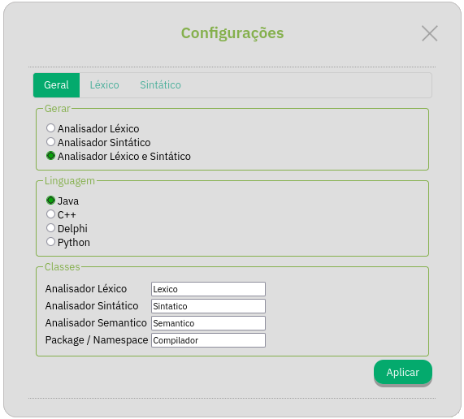
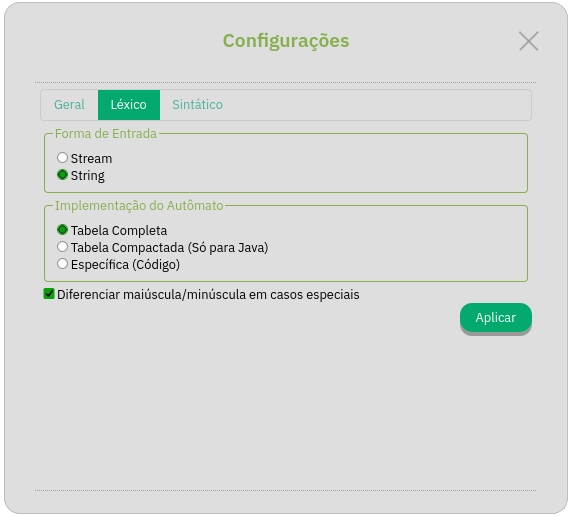
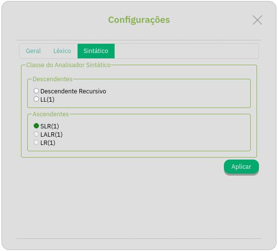

# Opções

O Web GALS oferece uma gama de opções quanto a configuração do projeto. Estas estão apresentadas em três abas, no menu de configurações acessível
na barra lateral esquerda da interface.

## Opções Gerais

O dialogo de configurações gerais permite o usuário escolher o quê será gerado e em qual linguagem, junto a escolhas de nomeamento.

<i>Diálogo das Configurações Gerais.</i>

#### Modal - Gerar

Estas opções permitem ao usuário escolher quais **partes** do compilador devem ser geradas, tendo como opção:

- **Analisador Léxico:** Será gerado somente o analisador léxico.
- **Analisador Sintático:** Será gerado somente o analisador sintático.
- **Analisadores Léxico e Sintático:** Serão gerado ambos.

> [!NOTE]
> Para o caso de somente gerar o analisador sintático, o usuário tera que implementar manualmente uma forma de fornecer Tokens ao analisador sintático.

#### Modal - Linguagem

Estas opções permitem o usuário escolher a **linguagem de implementação** do compilador gerado, tendo como opção:

- **Java**
- **C++**
- **Delphi**
- **Python**
- **Rust** (Não Finalizado)

> [!WARNING]
> A implementação em linguagem Delphi não tem suporte para todas as funcionalidades providas pelo Web GALS.

#### Entrada - Classes

Estas opções permitem o usuário escolher **o nome das classes e da hierarquía** do código gerado.

- **Analisador Léxico**
- **Analisador Sintático**
- **Analisador Semântico**
- **Package / Namespace / Module**

Para Java e C++ pode-se especificar a *package* e o *namespace* respectivamente onde serão geradas as classes. 
Para Python e Rust é possível especificar o *module* das classes, onde é criado a hierarquía de diretórios correspondente.

> [!NOTE]
> Não foi implementado para Delphi suporte para o sistema de nomeamento e hierarquia.

## Opções do Analisador Léxico

O diálogo de opções do analisador léxico permite o usuário configurar a geração do mesmo, provendo dois modais de configuração.

<i>Diálogo das Configurações Léxicas.</i>

#### Modal - Forma de Entrada

- **Stream:** Esta opção faz com que o Lexer seja implementado com o equivalente de uma *Stream* contínua. *Streams* carregam contínuamente a sua entrada ao invéz de tudo de uma véz só, e são propícios para a leitura de arquivos em disco, por exemplo.
- **String:** Esta opção faz com que o Lexer seja implementado com o equivalente de uma *String* de tamanho fixo e conhecido. Esta é a opção de mais simples implementação, porém terá dificuldades em carregar arquivos muito grandes devido a necessidade de manter todo o arquivo em memória; é porém proprícia para editores interativos, por exemplo.

Quanto a implementação desses sistemas, segue a tabela de classes:

| Linguagem | Forma de Entrada | Classe         |
|-----------|------------------|----------------|
| Java      | Stream           | java.io.Reader |
| C++       | Stream           | std::istream   |
| Delphi    | Stream           | TStream        |
| Python    | Stream           | io.StringIO    |
| Rust      | Stream           | ???            |
| --        | --               | --             |
| Java      | String           | String         |
| C++       | String           | std::string    |
| Delphi    | String           | string         |
| Python    | String           | str            |
| Rust      | String           | ???            |

> [!CAUTION]
> A implementação do modo *Stream* para C++, Java e Delphi, no momento, simplesmente
> leem o arquivo todo e o convertem para String, quebrando a expectativa de leitura gradual
> esperada de tal sistema.
>
> A implementação para Python faz uso correto das *Streams*, porém vaza memória devido a necessidade
> de backtracking arbitrário por parte do lexer, então em quesito de **uso de memória** ele é identico a versão modo *String*.

#### Modal - Implementação do Autômato

O analisador léxico é implementado sobre um autômato finito,
e este modal permite selecionar a implementação da função `next_state()` do autômato, tendo como escolha:

- **Tabela Completa:** Um *lookup* em tabela pré-gerada.
- **Tabela Compactada:** (Java) Similar a anterior; utiliza um *HashMap* para usar menos memória, porém é mais lerdo.
- **Específica:** O comportamento da função é codificada de forma explícita usando condicionais.

#### Checkbox - Diferencias maiúscula/minúscula em casos especiais

O analisador gerado sempre passa os tokens ao sintático (que passa ao semântico) exatamente como eles estavam no texto original, sem qualquer conversão entre maiúsculas e minúsculas.

Se se pretende gerar um analisador que não faça diferenciação entre maiúsculas minúsculas para os identificadores, esta capacidade deve ser programada em nível semântico.

Então para que serve esta opção?

Esta opção tem a ver com casos especiais, utilizados (geralmente) para a definição de palavras chave. Com esta opçào desabilitada, tanto `Begin` quanto `begin` quanto `BEGIN` seriam reconhecidos como o mesmo token, caso se tenha um caso especial de identificador com a representação igual a `begin`. 

## Opções do Analisador Sintático

O diálogo de opções do analisador sintático permite o usuário configurar qual tipo de analisador sintático será usado.

<i>Diálogo das Configurações Sintáticas.</i>

#### Classe do Analisador Sintático

- **Descendente Recursivo:** Analisador descendente via chamadas de funções recursivas. Muito popular entre compiladores implementados a mão.
- **LL(1):** A versão tabelada do descendente recursivo.
- **SLR(1):** Uma implementação do *Simple LR(1)*, parser ascendente tabelado e que utiliza esquema *Shift-Reduce*.
- **LALR(1)** (Não Finalizado)
- **LR(1) Canônico** (Não Finalizado)

Algumas classes impõem restrições sobre a gramática que aceitam, que devem ser observadas quando se for descrevê-la.

> [!NOTE]
> Os analisadores `LALR(1)` e `LR(1)` não estão disponíveis para Delphi.
