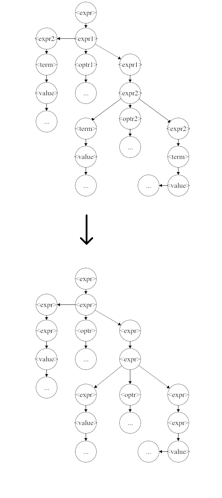
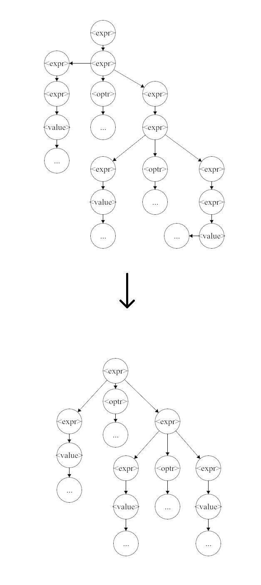
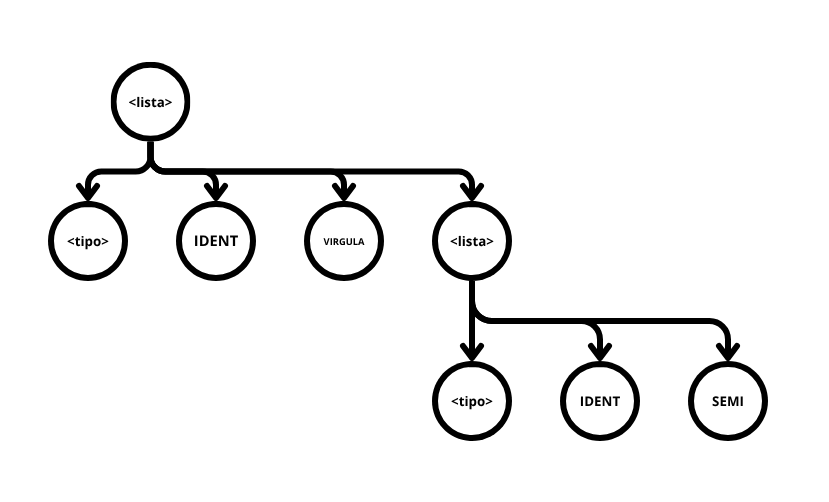
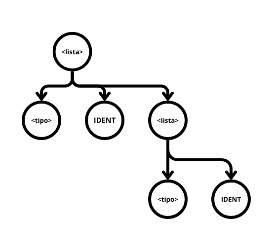
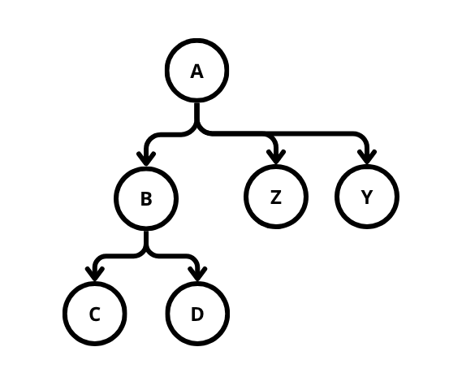
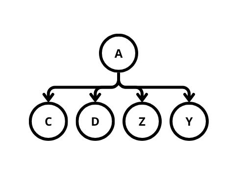
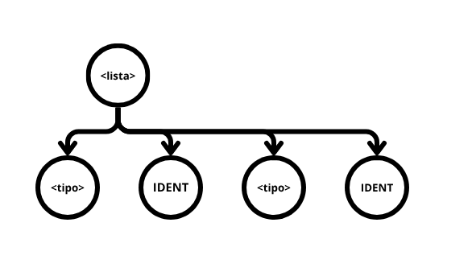

# Árvore Sintática em Memória

> [!WARNING]
> A biblioteca ainda está em desenvolvimento e atualmente suporta apenas Rust e C++.
> A API esta sujeita a mudar até novembro de 2026.

## Árvore abstrata

Tradicionalmente o processamento semântico e geração de código feito por um compilador
acontece via o uso das ações semânticas; identificadores numéricos presentes na gramática que
realizam *callbacks* a funções no compilador quando identificadas pelo analisador sintático
(no Web GALS tais funções sendo escritas dentro do método `executeAction()` da classe Semântico).

Este método é simples na implementação, porém restringe a complexidade do compilador já
que em nenhum momento da compilação o compilador tem acesso completo a árvore sintática
derivada pelo analisador sintático.

De fato, no uso das ações semânticas não só se limita as informações disponíveis ao compilador
(somente Tokens associados a uma ação semântica são enviados à classe Semântica), como conjuntos
de informações outrora sequenciais são quebrados em múltiplas chamadas de função (como no caso de lista de
identificadores em uma chamada de função, ou uma expressão binária).

Uma alternativa ao uso do sistema de ações semânticas é guardar a árvore sintática
derivada pelo analisador sintático na memoria e processa-la posteriormente. Esta árvore
dada pelo analisador denomina-se **Árvore Sintática Concreta**, já que ela representa precisamente
o que o analisador aceitou. No momento que se modifica uma árvore sintática concreta, ela se torna
uma **Árvore Sintática Abstrata** (*AST*), já que ela representa o programa, mas não necessariamente
o que o analisador sintático aceitou. Por questões de brevidade este documento ira referir ambas como abstrata.

O Web GALS suporta na sua geração de código uma biblioteca para a criação e manipulação de árvores sintáticas
abstratas, com múltiplas transformações pré implementadas prontas ao uso.

> [!NOTE]
> A biblioteca vem desativada por padrão, e é ativada no menu de configurações do Web GALS na secção sintática.

Ao habilitar a biblioteca, a função `parse()` da classe Sintático para de executar as ações semânticas e passa
a retornar a árvore sintática. Por questões de compatibilidade, caso a gramática possua ações semânticas, essas
são postas na árvore concreta em suas devidas posições, na qual podem ser processadas da maneira tradicional
posteriormente via uma *transformação*, exemplificado em Rust e C++:

```C++
try {
	auto tree = syn.parse(&lex);
	Node::transform(tree, [&sem](auto& n) {
		auto kind = n->getKind();
		if (kind.first == NodeKind::SemanticAction) {
			auto actlex = n->getActionLex();
			auto a = std::get<int>(kind.second);
			sem.executeAction(a + 1, actlex);
		}
	});
} catch ( ... ) {
	...
}
```
<center><i>Exemplo C++.</i></center>

```rust
let mut tree = syn.parse()?;
tree.try_transform(&mut |n| {
	if let NodeKind::SemanticAction(a) = n.get_kind() {
		sem.execute_action((*a + 1) as u32, n.get_actionlex().expect("token"))?;
	};
	Ok(())
})?;
```
<center><i>Exemplo Rust.</i></center>

Transformações são o coração desta metodologia. Uma transformação é uma função executada em todos os nós da
árvore seguindo uma ordem específica (a transformação acima sendo pós-ordem em profundidade).

Com o uso das transformações é possível simplificar e reorganizar a árvore abstrata, adicionar informações
a ela (como informações de tipagem), ou até mesmo usa-la de referência para a geração de código.

## Classe Node

A classe `Node` é a classe que representa os nós da árvore abstrata, e é o tipo retornado pela função `parse()`.
De dados, elas possuem o parâmetro `kind`, a variante (*tagged union*/*enum*) de que tipo de nó é esse, tendo quatro
opções: terminal, não-terminal, ação semântica e nó customizado; e `children`, sua lista de filhos. Métodos estão
disponíveis para acessar e modificar ambos.

> [!NOTE]
> Devido a grande quantidade de código presente nesta classe, vezes quatro, uma para cada implementação,
> somente suas descrições estão presentes neste documento. Peço que busquem protótipos de função no próprio
> código fonte dos arquivos gerados.

## Transformações Prontas

A biblioteca vem com seis transformações parametrizáveis que permitem modificar a árvore, no intuito de simplifica-la
para visualização e posterior processamento.

#### Transformção `assimilate`

Protótipo `assimilate(newkind: NodeKind, similars: List<NodeKind>)`.

Esta transformação ira percorrer a árvore procurando por
nós que se assemelham a qualquer `NodeKind` presente em `similars` e, caso ache, os morfará para `newkind`. Esta
transformação é útil para padronizar nós que representam a mesma informação. Por exemplo, dado a gramática:
```
<expr>  ::= <expr1>;
<expr1> ::= <expr2> | <expr2> <optr1> <expr1>;
<expr2> ::= <term>  | <term>  <optr2> <expr2>;
<optr1> ::= ...;
<optr2> ::= ...;
<term>  ::= <value> | OPEN <expr> CLOSE;
```
as regras `<expr>`, `<expr1>`, `<expr2>` e `<term>` representam as mesmas informações, mas necessitam ser não-terminais diferentes
por questões de precedência e ambiguidade. As regras de operador sofrem um problema parecido.
as transformações `assimilate(<expr>, [<expr1>, <expr2>, <term>])` e transformação `assimilate(<optr>, [<optr1>, <optr2>])`
irão padronizar a árvore abstrata como mostrado abaixo:

<center></center>
<center><i>Exemplo de transformação assimilate.</i></center>

> [!NOTE]
> A função `assimilate()`, e todas as transformações prontas, esperam argumentos do tipo NodeKind. Por exemplo,
> em Rust, uma das transformações acima seria escrita da seguinte forma:
> ```
> tree.assimilate(NodeKind::NonTerminal(NonTerm::nt_expr), &[
> 	NodeKind::NonTerminal(NonTerm::nt_expr1),
> 	NodeKind::NonTerminal(NonTerm::nt_expr2),
> 	NodeKind::NonTerminal(NonTerm::nt_term),
> ])
> ```
> A enumeração `NonTerm` está disponível no arquivo de constantes gerado com o projeto, junto com `TokenId` para terminais.
> 
> Para C++, o tipo `NodeKind` é quebrado em duas partes, onde funções como a anterior aceitam `std::pair<NodeKind, NodeData>` no lugar
> de `NodeKind`, com `NodeKind` sendo uma enumeração e `NodeData` sendo um `std::variant` com os dados da enumeração, por exemplo:
> ```
> Node::assimilate(
>   tree,
>   std::make_pair(NodeKind::NonTerminal, NonTerm::nt_expr),
>   std::vector<std::pair<NodeKind, NodeData>> {
>     std::make_pair(NodeKind::NonTerminal, NonTerm::nt_expr1),
>     std::make_pair(NodeKind::NonTerminal, NonTerm::nt_expr2),
>     std::make_pair(NodeKind::NonTerminal, NonTerm::nt_term ),
>   }
> );
> ```

#### Transformação `squash`

Protótipo `squash(target: NodeKind)`.

Esta transformação procura por nós similares a `target` nos quais tem somente
um nó filho e, caso o seu nó filho tenha o mesmo nodekind que seu pai, o filho é deletado, com os netos sendo transferidos para
o pai, eg.: `A tem B tem C,D,E → A tem C,D,E; B deletado`. Esta transformação é util em uso conjunto com a transformação anterior
para deletar nós reduntantes na árvore. Por exemplo, digamos que as padronizações de expressão anteriores foram executadas:
há uma grande chance que "cadeias" de `<expr>` aninhadas umas dentro das outras tenham sido formadas. A transformação `squash()` ira
"esmagar" estas cadeidas em um nó só. A figura abaixo exemplifica:

<center></center>
<center><i>Exemplo de transformação squash.</i></center>

#### Transformação `filter`

Protótipo: `filter(target: NodeKind, removelist: List<NodeKind>)`.

Esta transformação remove qualquer filho de `target` que esteja presente 
em `removelist`. Ela é útil para remover terminais que não apre­sentam significado semântico após a analise sintática, como pontos-vírgula
ou parênteses. Por exemplo, em uma lista de identificadores associados a tipos, é muito provavel que os elementos sejam separados por
vírgula, ou algo similar, porém somente os identificadores e os tipos apresentam significado semântico. 

Dado a seguinte gramatica:

```
<lista> ::= <tipo> IDENT SEMI | <tipo> IDENT VIRGULA <lista>;
```

e a seguinte possível derivação desta gramática:

<center></center>
<center><i>Exemplo para transformação filter.</i></center>

executar:

```C++
Node::filter(
	tree,
	std::make_pair(NodeKind::NonTerminal, NonTerm::nt_lista),
	std::vector<std::pair<NodeKind, NodeData>> {
		std::make_pair(NodeKind::Terminal, new Token(TokenId::t_VIRGULA, "", 0)),
		std::make_pair(NodeKind::Terminal, new Token(TokenId::t_SEMI, "", 0)),
	}
)
```

> [!NOTE]
> No C++, todas as transformações efetuam `delete` dos `Tokens*` recebidos via argumento.

irá deletar as virgulas e pontos-vírgulas da árvore abstrata, como da seguinte forma:

<center></center>
<center><i>Exemplo após transformação filter.</i></center>

#### Transformação `flatten`

Protótipo: `flatten(target: NodeKind)`.

Esta transformação é usada para deletar um nó, trocando-o por seus filhos.
Por exemplo, se um nó A tem um nó B, no qual o nó B tem filhos C e D, executar
flatten(B) deletará B e fará com que C e D sejam filhos de A, eg.:

<center></center>
<center><i>Exemplo pré transformação flatten.</i></center>

vira

<center></center>
<center><i>Exemplo pós transformação flatten.</i></center>

#### Transformação `enlistify`

Protótipo: `enlistify(target: NodeKind)`.

Esta transformação é usada para linearizar listas recursivas. Ele checa
se o nó raiz e seu último filho tem o mesmo tipo e, se for esse o caso, executa
`flatten()` em tal filho.

Por exemplo, se pegarmos o exemplo da transformação `filter()` e executarmos `enlistify(<lista>)` o resultado será:

<center></center>
<center><i>Exemplo após transformação enlistify.</i></center>

## Transformações Customizadas

As transformações são implementadas via a chamada do método correspondente em qualquer nó da árvore,
dando uma função lambda como argumento (que realizará a operação da transformação). A função lambda em sí
recebe um único argumento: o nó que está sendo atualmente processado. A função de transformação então irá
percorrer todos os nós filhos do nó na qual a transformação iniciada, executando a função lambda fornecida
tende eles de argumento.

O primeiro e principal método de transformação fornecida é, nomeada de acordo, `transform(t)`, específica com código
Rust abaixo:

```rust
pub fn transform<F>(self: &mut Box<Self>, t: &mut F)
where
	F: FnMut(&mut Box<Self>),
{
	self.children.iter_mut().for_each(|c| c.transform(t));
	t(self);
}
```

Esta função percorre a árvore _em profundidade_ com chamada _pós ordem_, ou seja, nós mais profundos primeiro, com
a sua função lambda sendo executada após chegar ao final da cadeia de nós, ou "na volta".

A função `transformPreorder(t)` também é em profundidade, mas executa _pré ordem_, ou seja, executa "na ida":
```rust
pub fn transform_preorder<F>(self: &mut Box<Self>, t: &mut F)
where
	F: FnMut(&mut Box<Self>),
{
	t(self)
	self.children.iter_mut().for_each(|c| c.transform_preorder(t));
}
```

A função `transformDual(t)` executa a lambda duas vezes, uma vez pré ordem e outra pós ordem. Tal operação é necessária
para a correta implementação da tipagem e escopagem do programa, já que importa para implementação de ambos se você 
esta "entrando" ou "saindo" de um nó.

```rust
pub fn transform_dual<F>(self: &mut Box<Self>, t: &mut F)
where
	F: FnMut(&mut Box<Self>, bool),
{
	t(self, false);
	self.children.iter_mut().for_each(|c| c.transform_dual(t));
	t(self, true);
}
```

A versões de C++ dessas funções são métodos estáticos devido ao fato de que o C++ não permite especializar a variável `this`
a qualquer tipo além de `T*`, porém o design da biblioteca requer um valor boxeado `std::unique_ptr<T>` como valor `this`, eg.:

```C++
// Equivalente C++ de transform(t)
static void transform(std::unique_ptr<Node>& self, std::function<void(std::unique_ptr<Node>&)> t);
// Então é chamada com
Node::transform(no, ...);
/* Ao invéz de
no->transform(...);
*/
```

_TODO nó customizado_

<!--
- *Nós customizados*
	- Explicar uso
	- Exemplo: Tipagem
-->